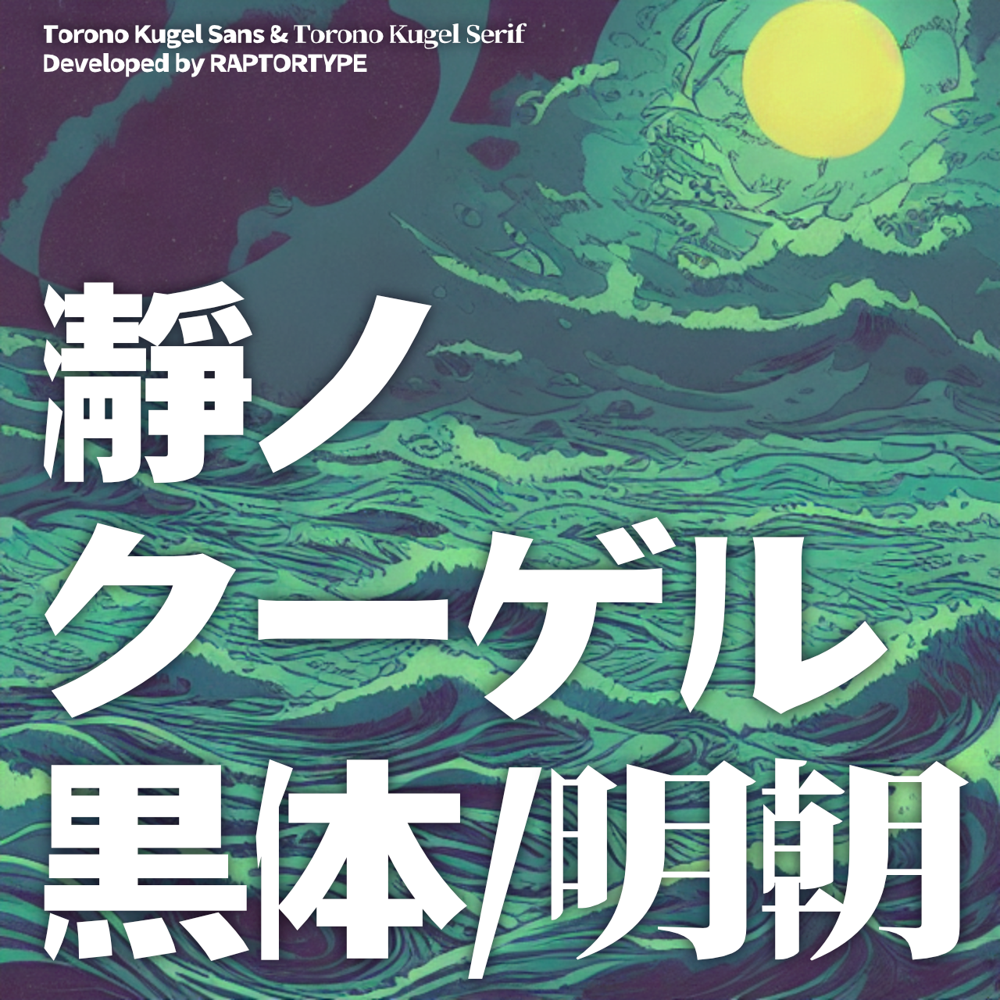
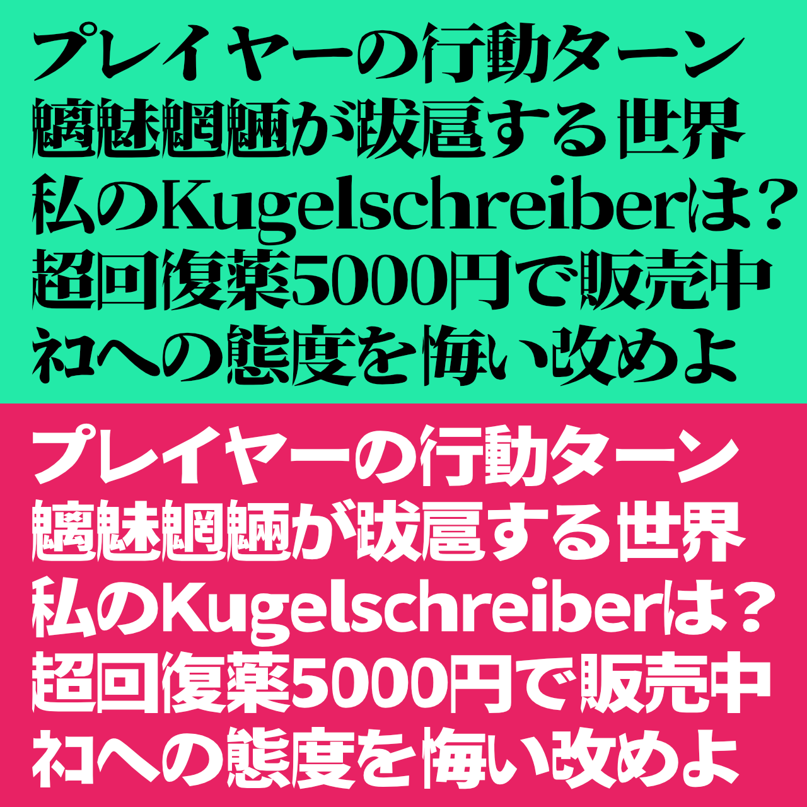

# 瀞ノクーゲル黒体 / 瀞ノクーゲル明朝

## フォントについて

- 源ノ角ゴシック、源ノ明朝を改変したフォントです。
- Fontworksの「ロウディ」からインスパイアを受けています。
- 読み方は「とろの・くーげる・こくたい」「とろの・くーげる・みんちょう」です。

## 配布ファイル

- 瀞ノクーゲル黒体.otf
- 瀞ノクーゲル明朝.otf
- ToronoKugelSans.otf
  - 瀞ノクーゲル黒体.otfのフォント名を英語にしたもの。中身は同一です。
- ToronoKugelSerif.otf
  - 瀞ノクーゲル明朝.otfのフォント名を英語にしたもの。中身は同一です。

## ベースフォント

- [源ノ角ゴシック JP V2.001](https://github.com/adobe-fonts/source-han-sans/tree/release)
- [源ノ明朝 JP V1.001](https://github.com/adobe-fonts/source-han-serif/tree/release)

## 注意事項

- 源ノ角ゴシック/源ノ明朝のライセンスに準じ、[SIL Open Font License](https://scripts.sil.org/cms/scripts/page.php?site_id=nrsi&id=OFL_web)を適用しています。
- 本フォントを利用したことによって発生したいかなる故障・損害についても責任を負いません。
- 機械的に処理している関係上、パスが崩れたグリフや空白になっているグリフが存在する可能性があります。あらかじめご了承ください。
- ソフトにより表示名が「ToronoKugelSans」（黒体）、「ToronoKugelSerif」（明朝）になる場合があります。

## 作者

- あまずさ鴒 (Amazusa Rei)
  - E-Mail: amazusa0@gmail.com
  - Twitter: @AmazusaRei
  - GitHub: https://github.com/amazusa

## 更新履歴

- 2022/10/30  瀞ノクーゲル黒体 ver1.0、瀞ノクーゲル明朝 ver1.0 公開
